<div align="center">
  
  <h1>Italicious 🇮🇹</h1>
  <h3>Il vero gusto dell'Italia, a portata di click 🍷🍕🍝</h3>
  
  <p>
    <b>Esplora</b> • <b>Gusta</b> • <b>Condividi</b>
  </p>

  <p>
    <a href="#-panoramica">🔥 Panoramica</a> •
    <a href="#-features">✨ Features</a> •
    <a href="#-tech-stack">⚡ Tech Stack</a> •
    <a href="#-architettura">🏛 Architettura</a> •
    <a href="#-installazione">🚀 Setup</a> •
    <a href="#-db-schema">🗄 Database</a> •
    <a href="#-team">👥 Team</a>
  </p>

  <br />

  <!-- Badges -->
  [](https://jdk.java.net/21/)
  [](https://jakarta.ee/)
  [](https://tomcat.apache.org/)
  [](https://www.mysql.com/)
  [](https://tailwindcss.com/)
  <br />
  [](https://www.eclipse.org/)
  [](https://www.unisa.it/)
  [](https://www.unisa.it/)
  
</div>

---

## 🏆 Riconoscimenti

> Progetto realizzato per il corso di **Tecnologie Software per il Web (TSW)**  
> **Università degli Studi di Salerno (UNISA)** — Laurea Triennale in Informatica (L-31)
>
> 🎖 **Valutazione:** 30/30 e Lode

---

## 🔥 Panoramica

**Italicious** non è il solito e-commerce. È un viaggio sensoriale tra le eccellenze enogastronomiche italiane.  
Sviluppato con passione e precisione ingegneristica, offre un'esperienza utente fluida e moderna per scoprire, acquistare e amare i prodotti tipici della nostra terra.

Dalla **Puglia** al **Piemonte**, ogni click racconta una storia di tradizione.

---

## ✨ Features

### 👤 **User Experience (Lato Utente)**

| Feature | Descrizione |
| :--- | :--- |
| **🗺️ Navigazione Immersiva** | Esplora l'Italia interattiva! Clicca su una regione e scopri i suoi tesori nascosti. |
| **📦 Catalogo Smart** | Filtri avanzati per regione, categoria e ricerca istantanea con autocomplete. |
| **🛒 Carrello Intelligente** | Inizia come ospite, continua come utente registrato. Il carrello ti segue ovunque. |
| **🚚 Checkout & Tracking** | Segui il tuo pacco in tempo reale con codice di tracciamento univoco. |
| **⭐ Community Review** | Leggi e scrivi recensioni verificate. La tua opinione conta! |
| **❤️ Wishlist** | Salva i tuoi prodotti del cuore e acquistali quando vuoi. |
| **📄 Fatturazione Automatica** | Ricevi fatture in PDF generate al momento dell'acquisto (powered by *OpenPDF*). |
| **🔐 Sicurezza al Top** | I tuoi dati sono al sicuro grazie a password hashing con **BCrypt**. |

### 🔧 **Admin Power (Lato Amministratore)**

| Feature | Descrizione |
| :--- | :--- |
| **🛠️ Dashboard Completa** | Controllo totale su prodotti, ordini e utenti. |
| **📦 Gestione Magazzino** | CRUD prodotti con *soft delete* per non perdere mai lo storico. |
| **📋 Gestione Ordini** | Aggiorna lo stato degli ordini (In lavorazione → Spedito → Consegnato) con un click. |
| **🔒 Accesso Limitato** | Filtri di autenticazione robusti proteggono l'area sensibile. |

---

## ⚡ Tech Stack

Un'architettura solida e moderna, costruita per durare.

### **Backend (Il Motore)**
*   **Java 21 (OpenJDK)**: Potenza e modernità.
*   **Jakarta EE 5.0 (Servlet/JSP)**: Lo standard enterprise per il web.
*   **MySQL 8**: Database relazionale performante e affidabile.
*   **jBCrypt**: Sicurezza password di livello militare.
*   **Gson**: Gestione JSON fluida e veloce.
*   **OpenPDF**: Generazione documenti PDF on-the-fly.

### **Frontend (Lo Stile)**
*   **JSP + JSTL**: Server-side rendering ottimizzato.
*   **Tailwind CSS**: Design system utility-first per interfacce responsive e moderne.
*   **JavaScript (Vanilla)**: Niente framework pesanti, solo codice puro e performante.
*   **FontAwesome 6**: Icone vettoriali scalabili.

---

## 🏛 Architettura

Il progetto implementa rigorosamente il pattern **MVC (Model-View-Controller)** supportato dal pattern **DAO (Data Access Object)** per una separazione delle responsabilità impeccabile.

```mermaid
graph TD
    User((👤 Utente)) -->|HTTP Request| Controller
    subgraph "Server (Tomcat 10)"
        Controller[⚙️ Servlets & Filters]
        Controller -->|Data Access| DAO[🗄️ DAO Layer]
        DAO -->|Queries| DB[(MySQL Database)]
        DB -->|ResultSets| DAO
        DAO -->|JavaBeans| Controller
        Controller -->|Attributes| View[🖥️ JSP Views]
    end
    View -->|HTML/CSS| User
```



---

## 🚀 Installazione

Sei pronto a provare Italicious? Segui questi passaggi:

1.  **Clone the Repo** 📥
    ```bash
    git clone https://github.com/KekkoCoppola/Italicious.git
    ```

2.  **Import in Eclipse** 🌑
    *   `File` → `Import` → `Existing Projects into Workspace`
    *   Assicurati di avere **Tomcat 10** configurato nei Runtime Environments.

3.  **Database Setup** 🗄️
    *   Crea un database `italiciousdb` in MySQL.
    *   Configura le credenziali in `src/main/java/Dao/DBConnection.java`.

4.  **Run & Enjoy** ▶️
    *   Tasto destro sul progetto → `Run As` → `Run on Server`.
    *   Apri `http://localhost:8080/Italicious/home` e goditi il viaggio!

---

## 🗄 Database Schema

Un'occhiata sotto il cofano alle nostre tabelle principali:

| Tabella | Ruolo | Relazioni Chiave |
| :--- | :--- | :--- |
| `Utente` | Gestione account e profili | 1:N con Ordini, Recensioni |
| `Prodotto` | Il cuore del catalogo | 1:N con Recensioni, OrdineProdotto |
| `Ordine` | Storico acquisti | N:1 con Utente, 1:N con OrdineProdotto |
| `Carrello` | Carrello persistente | N:N (Utente-Prodotto) |
| `Recensione` | Feedback utenti | N:1 con Utente e Prodotto |

---

## 👥 Team

Le menti dietro Italicious. Studenti di Informatica presso l'Università degli Studi di Salerno.

<table align="center">
  <tr>
    <td align="center">
      <br />
      <sub><b>Francesco Coppola</b></sub><br />
      <a href="https://github.com/KekkoCoppola" title="GitHub">💻 GitHub</a>
    </td>
        <td align="center">
      <!-- Sostituisci con l'username GitHub del secondo membro -->
      <br />
      <sub><b>Membro del Team</b></sub><br />
      <a href="#" title="GitHub">💻 GitHub</a>
    </td>
        <td align="center">
      <!-- Sostituisci con l'username GitHub del terzo membro -->
      <br />
      <sub><b>Membro del Team</b></sub><br />
      <a href="#" title="GitHub">💻 GitHub</a>
    </td>
  </tr>
</table>

---

<div align="center">
  <sub>Made with ❤️ at <a href="https://www.unisa.it/">UNISA</a> - Dipartimento di Informatica</sub>
</div>
